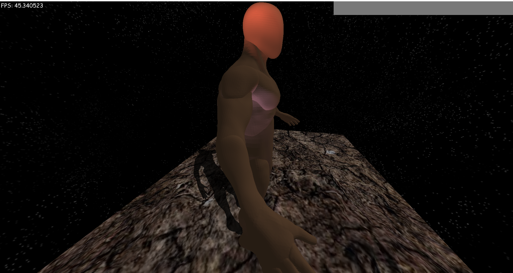
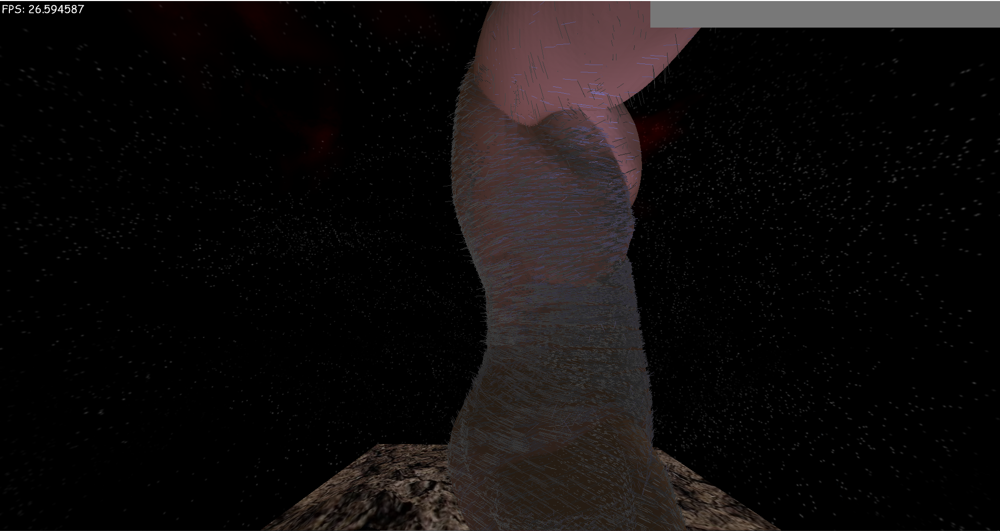

# TRenderer

TRenderer is a powerful rendering engine designed for creating 3D and 2D graphics using modern technologies.

## Features

### 3D Rendering
- **Deferred Shading**: Advanced rendering technique for improved lighting quality.
- **Point Light**: Support for point light sources.
- **Spot Light**: Implementation of spotlight with a cone angle.
- **Directional Light**: Light coming from a single direction, perfect for simulating sunlight.
- **Shadows from Directional Light**: Shadows from directional light to create depth and realism in the scene.

### 2D Rendering
- **2D Sprite Rendering**: Fast and efficient rendering of 2D sprites.
- **Text Rendering**: Support for text rendering using bitmap fonts.

### Additional Features
- **Texturing**: Texture mapping for object detailing.
- **Normal Drawing**: Support for normal maps to enhance lighting and create surface relief.
- **Skybox**: Realistic sky for environmental backgrounds.
